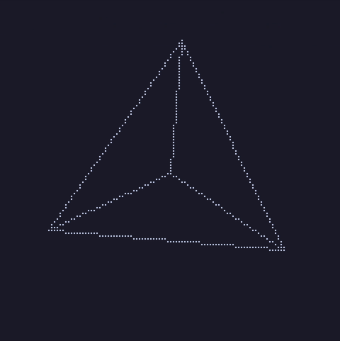
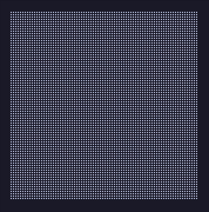

# A Dot-Matrix Display for Your Terminal

A Rust library providing a simulated dot-matrix display created with
braille unicode characters (`U+2800-28FF`), and an adapter crate for
using it with [`ratatui`](https://ratatui.rs).

 

See the individual crates for more information:
 - [`braillix`](/braillix)
 - [`braillix_ratatui`](/braillix_ratatui)

Currently under development.
